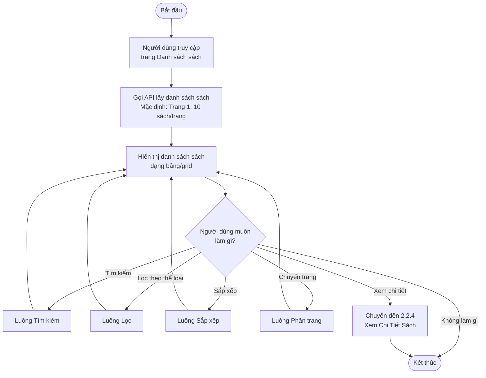
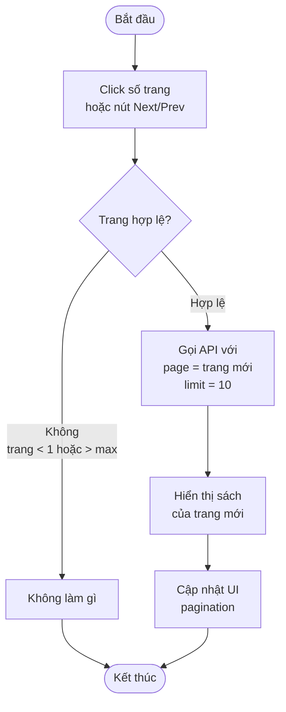

# 2.2.3 - Luồng Xem Danh Sách Sách

## Thông tin chung
- **Mã tính năng:** 2.2.3
- **Actor:** Tất cả người dùng (không cần đăng nhập)
- **Yêu cầu:** Không có
- **Mục đích:** Hiển thị danh sách sách với các chức năng tìm kiếm, lọc, sắp xếp

## Flowchart - Tổng quan



## Flowchart - Tìm kiếm

```mermaid
flowchart TD
    Start([Bắt đầu]) --> A[Nhập từ khóa vào<br/>ô tìm kiếm]
    A --> B[Nhấn Enter hoặc<br/>click icon Tìm kiếm]
    B --> C[Gọi API với<br/>keyword = từ khóa nhập]
    C --> D{Có kết quả?}
    
    D -->|Có| E[Hiển thị danh sách<br/>kết quả tìm kiếm]
    D -->|Không| F[Hiển thị thông báo:<br/>"Không tìm thấy sách<br/>phù hợp"]
    
    E --> End([Kết thúc])
    F --> End
```

## Flowchart - Lọc theo thể loại

```mermaid
flowchart TD
    Start([Bắt đầu]) --> A[Click dropdown<br/>"Thể loại"]
    A --> B[Hiển thị danh sách<br/>các thể loại]
    B --> C[Chọn thể loại<br/>muốn lọc]
    C --> D[Gọi API với<br/>categoryId = thể loại đã chọn]
    D --> E{Có kết quả?}
    
    E -->|Có| F[Hiển thị sách<br/>thuộc thể loại]
    E -->|Không| G[Hiển thị thông báo:<br/>"Không có sách<br/>trong thể loại này"]
    
    F --> End([Kết thúc])
    G --> End
```

## Flowchart - Sắp xếp

```mermaid
flowchart TD
    Start([Bắt đầu]) --> A[Click dropdown<br/>"Sắp xếp theo"]
    A --> B[Hiển thị các tùy chọn:<br/>- Tên A-Z<br/>- Năm xuất bản mới nhất<br/>- Phổ biến nhất]
    B --> C{Chọn tiêu chí<br/>sắp xếp}
    
    C -->|Tên A-Z| D[sortBy=name<br/>order=ASC]
    C -->|Năm XB mới nhất| E[sortBy=publishYear<br/>order=DESC]
    C -->|Phổ biến nhất| F[sortBy=borrowCount<br/>order=DESC]
    
    D --> G[Gọi API với<br/>params sắp xếp]
    E --> G
    F --> G
    
    G --> H[Hiển thị danh sách<br/>đã sắp xếp]
    H --> End([Kết thúc])
```

## Flowchart - Phân trang



## Thông tin hiển thị mỗi sách

| Trường | Mô tả |
|--------|-------|
| Tên sách | Tiêu đề sách |
| Tác giả | Tên tác giả |
| Năm xuất bản | Năm XB |
| Thể loại | Tên thể loại |
| Số lượng có sẵn | Số sách còn trong kho |
| Số lượng đang mượn | Số sách đang được mượn |

## API Parameters

| Parameter | Mô tả | Mặc định |
|-----------|-------|----------|
| `page` | Số trang hiện tại | 1 |
| `limit` | Số sách mỗi trang | 10 |
| `keyword` | Từ khóa tìm kiếm (tên sách hoặc tác giả) | null |
| `categoryId` | ID thể loại để lọc | null |
| `sortBy` | Trường sắp xếp: name, publishYear, borrowCount | name |
| `order` | Thứ tự: ASC, DESC | ASC |

## Các tùy chọn sắp xếp

| Tùy chọn | sortBy | order | Mô tả |
|----------|--------|-------|-------|
| Tên (A-Z) | name | ASC | Sắp xếp theo tên từ A đến Z |
| Năm xuất bản (Mới nhất) | publishYear | DESC | Sách mới xuất bản trước |
| Phổ biến nhất | borrowCount | DESC | Sách được mượn nhiều nhất trước |

## Ghi chú
- Tìm kiếm theo cả tên sách và tác giả
- Có thể kết hợp tìm kiếm + lọc + sắp xếp cùng lúc
- Phân trang giúp tăng hiệu suất khi có nhiều sách
- Không cần đăng nhập để xem danh sách sách (public)

