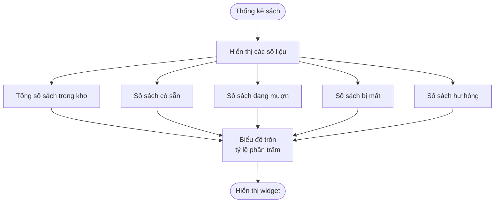
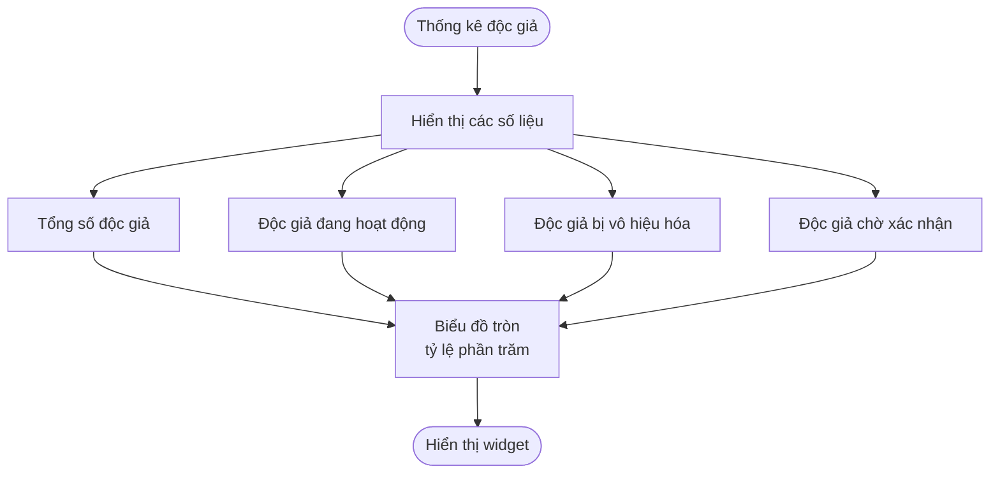

# 2.7.1 - Luồng Báo Cáo Tổng Quan (Dashboard)

## Thông tin chung
- **Mã tính năng:** 2.7.1
- **Actor:** Quản lý viên (Admin), Nhân viên thư viện (Librarian)
- **Yêu cầu:** 
  - Đăng nhập với vai trò Admin hoặc Librarian (2.1.2)
  - Có dữ liệu sách, mượn, trả trong hệ thống
- **Mục đích:** Hiển thị tổng quan về tình trạng thư viện

## Flowchart

```mermaid
flowchart TD
    Start([Bắt đầu]) --> A[Admin/Librarian<br/>đăng nhập]
    A --> B[Hệ thống tự động<br/>chuyển đến Dashboard]
    B --> C[Gọi API lấy<br/>dữ liệu thống kê]
    
    C --> D{API trả về<br/>thành công?}
    
    D -->|Lỗi| E[Hiển thị thông báo:<br/>"Không thể tải<br/>dữ liệu thống kê"]
    E --> F[Hiển thị nút<br/>"Thử lại"]
    F --> C
    
    D -->|Thành công| G[Hiển thị Dashboard<br/>với các widget]
    
    G --> H[Widget 1:<br/>Thống kê sách]
    G --> I[Widget 2:<br/>Thống kê độc giả]
    G --> J[Widget 3:<br/>Đơn mượn hôm nay]
    G --> K[Widget 4:<br/>Top 5 sách phổ biến]
    G --> L[Widget 5:<br/>Độc giả nợ quá hạn]
    
    H --> M{Người dùng<br/>muốn làm gì?}
    I --> M
    J --> M
    K --> M
    L --> M
    
    M -->|Xem chi tiết sách| N[Chuyển đến<br/>Danh sách sách]
    M -->|Xem chi tiết độc giả| O[Chuyển đến<br/>Danh sách người dùng]
    M -->|Xem đơn mượn| P[Chuyển đến<br/>Quản lý mượn trả]
    M -->|Xem báo cáo chi tiết| Q[Chuyển đến 2.7.2]
    M -->|Refresh dữ liệu| C
    M -->|Không làm gì| End([Kết thúc])
    
    N --> End
    O --> End
    P --> End
    Q --> End
```

## Widget 1: Thống kê sách



## Widget 2: Thống kê độc giả



## Các widget trên Dashboard

### Widget 1: Thống kê sách

| Chỉ số | Mô tả | Icon/Màu |
|--------|-------|----------|
| Tổng số sách | Tổng số đầu sách trong kho | 📚 Xanh dương |
| Có sẵn | Sách đang có sẵn để mượn | ✅ Xanh lá |
| Đang mượn | Sách đang được độc giả mượn | 📖 Vàng |
| Bị mất | Sách đã bị mất | ❌ Đỏ |
| Hư hỏng | Sách bị hư hỏng | ⚠️ Cam |

### Widget 2: Thống kê độc giả

| Chỉ số | Mô tả | Icon/Màu |
|--------|-------|----------|
| Tổng số | Tổng số tài khoản độc giả | 👥 Xanh dương |
| Hoạt động | Tài khoản đang hoạt động | ✅ Xanh lá |
| Vô hiệu hóa | Tài khoản bị vô hiệu hóa | 🚫 Đỏ |
| Chờ xác nhận | Tài khoản mới chờ duyệt | ⏳ Vàng |

### Widget 3: Đơn mượn hôm nay

| Chỉ số | Mô tả |
|--------|-------|
| Tổng đơn | Số đơn mượn được tạo hôm nay |
| Đã xác nhận | Số đơn đã được xác nhận |
| Chờ xác nhận | Số đơn đang chờ xử lý |
| Từ chối | Số đơn bị từ chối |

### Widget 4: Top 5 sách phổ biến

| Trường | Mô tả |
|--------|-------|
| Xếp hạng | Thứ tự từ 1-5 |
| Tên sách | Tên sách được mượn nhiều |
| Tác giả | Tên tác giả |
| Số lượt mượn | Tổng số lần được mượn |

### Widget 5: Độc giả nợ quá hạn

| Trường | Mô tả |
|--------|-------|
| Tên độc giả | Tên người nợ |
| Email | Email liên hệ |
| Số sách quá hạn | Số sách chưa trả quá hạn |
| Số ngày trễ | Số ngày quá hạn nhiều nhất |
| Tổng tiền phạt | Tổng tiền phạt chưa thanh toán |

## API Response Example

```json
{
  "books": {
    "total": 500,
    "available": 350,
    "borrowed": 130,
    "lost": 10,
    "damaged": 10
  },
  "readers": {
    "total": 200,
    "active": 180,
    "disabled": 15,
    "pending": 5
  },
  "todayBorrowings": {
    "total": 25,
    "confirmed": 20,
    "pending": 3,
    "rejected": 2
  },
  "topBooks": [
    {
      "rank": 1,
      "name": "Đắc Nhân Tâm",
      "author": "Dale Carnegie",
      "borrowCount": 150
    }
  ],
  "overdueReaders": [
    {
      "name": "Nguyễn Văn A",
      "email": "a@example.com",
      "overdueBooks": 2,
      "maxOverdueDays": 10,
      "totalFine": 100000
    }
  ]
}
```

## Tính năng bổ sung

| Tính năng | Mô tả |
|-----------|-------|
| Auto-refresh | Tự động cập nhật mỗi 5 phút |
| Manual refresh | Nút refresh thủ công |
| Click để xem chi tiết | Click vào widget để xem báo cáo chi tiết |
| Responsive | Hiển thị tốt trên mobile |

## Ghi chú
- Dashboard là trang mặc định sau khi đăng nhập cho Admin/Librarian
- Dữ liệu được cache và refresh định kỳ để giảm tải server
- Có thể click vào từng widget để xem chi tiết hơn
- Biểu đồ sử dụng thư viện Recharts

